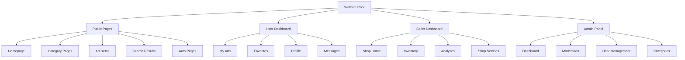

# Premium Marketplace - UX Structure & Wireframe Specification

> **Role:** Senior UX Planner & Product Designer  
> **Target:** Mobile-First, Premium, Next-Gen  
> **Platform:** Web + React Native (shared flows)

---

## 1. Website Structure Overview



---

## 2. Public Pages

### 2.1 Homepage (`/`)

**Purpose:** First impression, discovery, navigation hub

**Layout Structure:**
```
┌────────────────────────────────────────────────┐
│ [Logo]    Search Bar    [City] [Login/Avatar] │ ← Sticky Header
├────────────────────────────────────────────────┤
│                                                │
│     Hero Section                               │
│     • Premium tagline                          │
│     • Search bar (large)                       │
│     • Popular categories (icons)               │
│                                                │
├────────────────────────────────────────────────┤
│  Category Grid (2x4 on mobile, 4x3 desktop)   │
│  ┌──────┐ ┌──────┐ ┌──────┐ ┌──────┐         │
│  │ 📱   │ │ 🚗   │ │ 🏠   │ │ 👔   │         │
│  │Mobile│ │Cars  │ │Property│ │Fashion        │
│  └──────┘ └──────┘ └──────┘ └──────┘         │
├────────────────────────────────────────────────┤
│  Recent Ads Feed                               │
│  ┌─────────────────────────────────────────┐  │
│  │ [Img] Title          PKR 25,000     ⭐  │  │
│  │       Lahore • 2 hours ago              │  │
│  └─────────────────────────────────────────┘  │
│  ┌─────────────────────────────────────────┐  │
│  │ [Img] Title          PKR 450,000    🔥  │  │
│  │       Karachi • 5 hours ago             │  │
│  └─────────────────────────────────────────┘  │
│  [...more ads, infinite scroll]               │
├────────────────────────────────────────────────┤
│  Footer (Links, Social, Download App)         │
└────────────────────────────────────────────────┘
```

**Key UI Components:**
- **Header:** Logo, search, city selector (dropdown), auth CTA/avatar
- **Hero Banner:** Premium gradient background, large search input, category quick links
- **Category Cards:** Icon, name, ad count badge
- **Ad Card:** Image, title, price, location, time ago, badges (featured/urgent)
- **Floating Action Button (Mobile):** "Post Ad" - always visible

---

### 2.2 Category Page (`/category/:slug`)

**Purpose:** Browse ads within a specific category

**Layout Structure:**
```
┌────────────────────────────────────────────────┐
│ [Header - Same as Homepage]                    │
├────────────────────────────────────────────────┤
│ Home > Electronics > Mobile Phones             │ ← Breadcrumb
├────────────────────────────────────────────────┤
│                                                │
│ ┌──────────┐                                  │
│ │ Filters  │  Subcategory Tabs                │
│ │ ▼        │  [All] [Samsung] [Apple] [Others]│
│ │          │                                   │
│ │ Price    │  Sort: [Newest ▼]  [Grid] [List] │
│ │ ━━━━━━━  │  ────────────────────────────────│
│ │          │  ┌────────┐ ┌────────┐ ┌────────┐│
│ │ Condition│  │[Image] │ │[Image] │ │[Image] ││
│ │ □ New    │  │Title   │ │Title   │ │Title   ││
│ │ □ Used   │  │PKR 25K │ │PKR 30K │ │PKR 20K ││
│ │          │  │Lahore  │ │Karachi │ │Islamabad│
│ │ City     │  └────────┘ └────────┘ └────────┘│
│ │ □ Lahore │  ┌────────┐ ┌────────┐ ┌────────┐│
│ │ □ Karachi│  │[Image] │ │[Image] │ │[Image] ││
│ └──────────┘  └────────┘ └────────┘ └────────┘│
│               [Load More]                      │
└────────────────────────────────────────────────┘
```

**Key UI Components:**
- **Breadcrumb:** Clickable navigation trail
- **Filter Sidebar:** Collapsible on mobile, price range slider, checkboxes
- **Subcategory Tabs:** Horizontal scroll on mobile
- **Sort Dropdown:** Newest, Price (low-high), Price (high-low)
- **View Toggle:** Grid vs List view
- **Ad Grid:** Responsive (1 col mobile, 3 col tablet, 4 col desktop)
- **Pagination:** Infinite scroll or "Load More" button

---

### 2.3 Ad Detail Page (`/ad/:slug`)

**Purpose:** Full ad information, seller contact, similar ads

**Layout Structure:**
```
┌────────────────────────────────────────────────┐
│ [Header]                                       │
├────────────────────────────────────────────────┤
│ Home > Category > Subcategory > Ad Title      │
├────────────────────────────────────────────────┤
│                                                │
│ ┌──────────────────────┐  ┌─────────────────┐ │
│ │                      │  │ PKR 45,000      │ │
│ │   Image Gallery      │  │ Negotiable      │ │
│ │   (Swipeable)        │  │                 │ │
│ │   [Main Image]       │  │ 📍 Lahore, DHA  │ │
│ │   ○ ○ ○ ○ ○         │  │ ⏰ 2 hours ago  │ │
│ │                      │  │                 │ │
│ └──────────────────────┘  │ [💬 Chat]       │ │
│                           │ [📞 Call]       │ │
│ iPhone 14 Pro Max 256GB   │ [❤️ Favorite]   │ │
│ Used - Like New           └─────────────────┘ │
│                                                │
│ Description:                                   │
│ Lorem ipsum dolor sit amet, consectetur        │
│ adipiscing elit. Original box, all accessories │
│ included, no scratches.                        │
│                                                │
│ Specifications:                                │
│ • Storage: 256GB                               │
│ • Color: Deep Purple                           │
│ • Condition: Like New                          │
│                                                │
│ ┌──────────────────────────────────────────┐  │
│ │ 👤 Seller: Ali Khan                      │  │
│ │    ✅ Verified • Member since Jan 2024   │  │
│ │    4.8★ (23 reviews) • 89 ads posted     │  │
│ │    [View Profile]                        │  │
│ └──────────────────────────────────────────┘  │
│                                                │
│ Safety Tips:                                   │
│ • Meet in public place                         │
│ • Check item before payment                    │
│ • Never send advance payment                   │
│                                                │
│ Similar Ads:                                   │
│ ┌────────┐ ┌────────┐ ┌────────┐ ┌────────┐  │
│ │[Image] │ │[Image] │ │[Image] │ │[Image] │  │
│ │PKR 40K │ │PKR 48K │ │PKR 42K │ │PKR 46K │  │
│ └────────┘ └────────┘ └────────┘ └────────┘  │
│                                                │
│ 🚩 Report this ad                              │
└────────────────────────────────────────────────┘
```

**Key UI Components:**
- **Image Gallery:** Swipeable carousel with indicators, pinch-to-zoom
- **Price Card:** Sticky on scroll (mobile), prominent CTA buttons
- **Action Buttons:** Chat (primary), Call (secondary), Favorite (icon)
- **Seller Card:** Avatar, name, verification badge, stats, rating
- **Specifications List:** Key-value pairs
- **Safety Tips:** Collapsible alert box
- **Similar Ads Carousel:** Horizontal scroll
- **Report Link:** Bottom of page

---

### 2.4 Search Results (`/search?q=...`)

**Purpose:** Display search results with filters

**Layout:** Similar to Category Page but with:
- Search query highlighted
- "No category filter" by default
- Result count: "234 results for 'iPhone'"
- Suggested filters based on query

---

### 2.5 Auth Pages

#### 2.5.1 Login/Register (`/auth/login`)

**Purpose:** Phone-based authentication

```
┌────────────────────────────────────────────────┐
│           [Logo]                               │
│                                                │
│     Welcome to [Platform Name]                 │
│     Your premium marketplace                   │
│                                                │
│ ┌────────────────────────────────────────────┐│
│ │ 📱 Phone Number                            ││
│ │ ┌──────────────────────────────────────┐  ││
│ │ │ +92  |__________________|           │  ││
│ │ └──────────────────────────────────────┘  ││
│ │                                            ││
│ │ [Send OTP]                                 ││
│ │                                            ││
│ │          or continue with                  ││
│ │                                            ││
│ │ [🔵 Continue with Google]                 ││
│ └────────────────────────────────────────────┘│
│                                                │
│ By continuing, you agree to our                │
│ Terms of Service and Privacy Policy            │
└────────────────────────────────────────────────┘
```

#### 2.5.2 OTP Verification (`/auth/verify`)

```
┌────────────────────────────────────────────────┐
│           [← Back]                             │
│                                                │
│     Enter OTP                                  │
│     Sent to +92 300 1234567                    │
│                                                │
│     ┌───┐ ┌───┐ ┌───┐ ┌───┐ ┌───┐ ┌───┐     │
│     │ 1 │ │ 2 │ │ 3 │ │ 4 │ │ 5 │ │ 6 │     │
│     └───┘ └───┘ └───┘ └───┘ └───┘ └───┘     │
│                                                │
│     Didn't receive? Resend in 0:45             │
│                                                │
│     [Verify]                                   │
└────────────────────────────────────────────────┘
```

**Key UI Components:**
- **Phone Input:** Country code selector + number input
- **OTP Input:** 6 auto-focusing digit boxes
- **OAuth Buttons:** Google (Phase 1), Facebook (Phase 2)
- **Resend Timer:** Countdown before allowing resend

---

## 3. User Dashboard

**Access:** Logged-in users only  
**Layout:** Sidebar navigation (desktop), bottom tabs (mobile)

### 3.1 Navigation Structure

**Mobile Bottom Tabs:**
```
┌─────┬─────┬─────┬─────┬─────┐
│ 🏠  │ 💬  │ ➕  │ ❤️  │ 👤  │
│Home │Chat │Post │Saved│ Me  │
└─────┴─────┴─────┴─────┴─────┘
```

**Desktop Sidebar:**
```
├── 📊 Dashboard
├── 📝 My Ads
├── ❤️ Favorites
├── 💬 Messages
├── 👤 Profile
└── ⚙️ Settings
```

---

### 3.2 My Ads (`/dashboard/ads`)

**Purpose:** Manage posted ads

```
┌────────────────────────────────────────────────┐
│ My Ads                          [+ Post New Ad]│
├────────────────────────────────────────────────┤
│ Tabs: [All] [Active] [Pending] [Sold] [Expired]│
├────────────────────────────────────────────────┤
│                                                │
│ ┌─────────────────────────────────────────┐   │
│ │ [Image] iPhone 14 Pro Max               │   │
│ │         PKR 45,000                      │   │
│ │         👁 234 views • ❤️ 12 favorites   │   │
│ │         Status: Active                  │   │
│ │         [Edit] [Mark Sold] [•••]        │   │
│ └─────────────────────────────────────────┘   │
│                                                │
│ ┌─────────────────────────────────────────┐   │
│ │ [Image] Honda Civic 2020                │   │
│ │         PKR 4,500,000                   │   │
│ │         👁 567 views • ❤️ 34 favorites   │   │
│ │         Status: Active • ⭐ Featured     │   │
│ │         [Edit] [Boost] [•••]            │   │
│ └─────────────────────────────────────────┘   │
│                                                │
│ ┌─────────────────────────────────────────┐   │
│ │ [Image] MacBook Pro M2                  │   │
│ │         PKR 250,000                     │   │
│ │         👁 89 views • ❤️ 5 favorites     │   │
│ │         Status: Pending Approval        │   │
│ │         [Edit] [Delete]                 │   │
│ └─────────────────────────────────────────┘   │
└────────────────────────────────────────────────┘
```

**Key UI Components:**
- **Tab Filters:** Count badges on each tab
- **Ad Card (Expanded):** Stats, status badge, action buttons
- **Action Menu (•••):** More options (duplicate, delete, share)
- **Status Badge:** Color-coded (green=active, yellow=pending, red=expired)
- **Empty State:** "No ads yet" with CTA to post first ad

---

### 3.3 Post Ad Flow (Modal/Full Page)

**Purpose:** Create new listing

#### Step 1: Select Category
```
┌────────────────────────────────────────────────┐
│ ← Post an Ad                           [X]     │
├────────────────────────────────────────────────┤
│ Step 1 of 3: Choose Category                   │
│ ━━━━━━━━━━━━━━━━━━━━━━━━━━━━━━━              │
│                                                │
│ ┌──────────┐ ┌──────────┐ ┌──────────┐       │
│ │ 📱       │ │ 🚗       │ │ 🏠       │       │
│ │Electronics│ │ Vehicles │ │ Property │       │
│ └──────────┘ └──────────┘ └──────────┘       │
│ ┌──────────┐ ┌──────────┐ ┌──────────┐       │
│ │ 👔       │ │ 🏡       │ │ 🎮       │       │
│ │ Fashion  │ │ Home     │ │ Hobbies  │       │
│ └──────────┘ └──────────┘ └──────────┘       │
│                                                │
│                              [Next →]          │
└────────────────────────────────────────────────┘
```

#### Step 1.5: Select Subcategory (if parent selected)
```
┌────────────────────────────────────────────────┐
│ ← Electronics                          [X]     │
├────────────────────────────────────────────────┤
│ Choose subcategory:                            │
│                                                │
│ ○ Mobile Phones                                │
│ ○ Laptops & Computers                          │
│ ○ Tablets                                      │
│ ○ Cameras                                      │
│ ○ Accessories                                  │
│ ○ Other Electronics                            │
│                                                │
│                              [Next →]          │
└────────────────────────────────────────────────┘
```

#### Step 2: Add Details
```
┌────────────────────────────────────────────────┐
│ ← Ad Details                           [X]     │
├────────────────────────────────────────────────┤
│ Step 2 of 3: Add Details                       │
│ ━━━━━━━━━━━━━━━━━━━━━━━━━━━━━━━              │
│                                                │
│ Title *                                        │
│ ┌────────────────────────────────────────────┐│
│ │ iPhone 14 Pro Max 256GB                    ││
│ └────────────────────────────────────────────┘│
│ 25/150                                         │
│                                                │
│ Description (optional)                         │
│ ┌────────────────────────────────────────────┐│
│ │ Original box, all accessories included...  ││
│ │                                            ││
│ └────────────────────────────────────────────┘│
│                                                │
│ Photos * (Max 8)                               │
│ ┌────┐ ┌────┐ ┌────┐ ┌────┐ ┌────┐          │
│ │ +  │ │[Img]│ │[Img]│ │[Img]│ │ +  │          │
│ └────┘ └────┘ └────┘ └────┘ └────┘          │
│                                                │
│ Price *              Condition *               │
│ ┌──────────┐        ○ New                     │
│ │ 45000    │        ● Used - Like New          │
│ └──────────┘        ○ Used - Good              │
│ ● Fixed             ○ Used - Fair              │
│ ○ Negotiable                                   │
│ ○ Contact for price                            │
│                                                │
│                              [Next →]          │
└────────────────────────────────────────────────┘
```

#### Step 3: Location & Submit
```
┌────────────────────────────────────────────────┐
│ ← Location                             [X]     │
├────────────────────────────────────────────────┤
│ Step 3 of 3: Location                          │
│ ━━━━━━━━━━━━━━━━━━━━━━━━━━━━━━━              │
│                                                │
│ City *                                         │
│ ┌────────────────────────────────────────────┐│
│ │ Lahore                            ▼        ││
│ └────────────────────────────────────────────┘│
│                                                │
│ Area/Neighborhood                              │
│ ┌────────────────────────────────────────────┐│
│ │ DHA Phase 5                                ││
│ └────────────────────────────────────────────┘│
│                                                │
│ ┌────────────────────────────────────────────┐│
│ │ 📍 Use current location                    ││
│ └────────────────────────────────────────────┘│
│                                                │
│ Preview:                                       │
│ ┌─────────────────────────────────────────┐  │
│ │ [Img] iPhone 14 Pro Max 256GB           │  │
│ │       PKR 45,000 • Used - Like New      │  │
│ │       Lahore, DHA Phase 5               │  │
│ └─────────────────────────────────────────┘  │
│                                                │
│ [← Back]                    [Post Ad →]        │
└────────────────────────────────────────────────┘
```

**Success Screen:**
```
┌────────────────────────────────────────────────┐
│                                                │
│              ✅                                │
│                                                │
│     Ad Posted Successfully!                    │
│                                                │
│     Your ad is pending approval.               │
│     We'll notify you once it's live.           │
│                                                │
│     [View Ad] [Post Another] [Go to Dashboard] │
│                                                │
└────────────────────────────────────────────────┘
```

**Key UI Components:**
- **Progress Bar:** Visual indicator of completion
- **Image Upload:** Drag-drop zone, reorderable thumbnails
- **Character Counter:** Real-time on title/description
- **Radio Buttons:** Price type, condition
- **Dropdown:** City selector with search
- **Preview Card:** Live preview of final ad

---

### 3.4 Favorites (`/dashboard/favorites`)

**Purpose:** Saved ads for later

```
┌────────────────────────────────────────────────┐
│ Saved Ads (23)                   [Sort ▼]      │
├────────────────────────────────────────────────┤
│                                                │
│ ┌─────────────────────────────────────────┐   │
│ │ [Image] iPhone 14 Pro Max         ❤️   │   │
│ │         PKR 45,000                      │   │
│ │         Lahore • Active                 │   │
│ │         [Chat Seller]                   │   │
│ └─────────────────────────────────────────┘   │
│                                                │
│ ┌─────────────────────────────────────────┐   │
│ │ [Image] Honda Civic 2020          ❤️   │   │
│ │         PKR 4,500,000                   │   │
│ │         Karachi • Sold                  │   │
│ │         [View Similar]                  │   │
│ └─────────────────────────────────────────┘   │
│                                                │
│ Empty State (if no favorites):                 │
│ ┌─────────────────────────────────────────┐   │
│ │         💔                              │   │
│ │     No saved ads yet                    │   │
│ │     Tap ❤️ on any ad to save it here    │   │
│ │     [Browse Ads]                        │   │
│ └─────────────────────────────────────────┘   │
└────────────────────────────────────────────────┘
```

**Key UI Components:**
- **Favorite Toggle:** Heart icon, filled = saved
- **Status Indicator:** Show if ad is sold/expired
- **Sort Options:** Recently added, Price (low-high)

---

### 3.5 Messages/Chat (`/dashboard/messages`)

**Purpose:** Buyer-seller conversations

**Layout:**
```
┌──────────────┬─────────────────────────────────┐
│Conversations │ Chat with Ali Khan              │
│              │ Re: iPhone 14 Pro Max           │
├──────────────┼─────────────────────────────────┤
│ 🟢 Ali Khan  │                                 │
│ iPhone 14... │ ┌─────────────────────────┐     │
│ 2 min ago    │ │ Hi, is it still avail? │ Me  │
│              │ └─────────────────────────┘     │
│ Sara Ahmed   │ ┌─────────────────────────┐     │
│ Civic 2020...│ │ Yes, available. You    │ Ali │
│ 1 hour ago   │ │ can come see it today.  │     │
│              │ └─────────────────────────┘     │
│ Ahmed Ali    │ ┌─────────────────────────┐     │
│ MacBook...   │ │ Great! What time?      │ Me  │
│ Yesterday    │ └─────────────────────────┘     │
│              │                                 │
│              │ ┌───────────────────────────┐   │
│              │ │ Type message...    [Send]│   │
│              │ └───────────────────────────┘   │
└──────────────┴─────────────────────────────────┘
```

**Mobile (Single View):**
```
Conversation List:
┌────────────────────────────────────────────────┐
│ Messages (3 unread)                    [🔍]    │
├────────────────────────────────────────────────┤
│ ● Ali Khan           iPhone 14 Pro Max  2m    │
│   Yes, available. You can...                   │
├────────────────────────────────────────────────┤
│   Sara Ahmed         Honda Civic       1h     │
│   When can I see it?                           │
├────────────────────────────────────────────────┤
│   Ahmed Ali          MacBook Pro       1d     │
│   Ok, deal!                                    │
└────────────────────────────────────────────────┘

Chat View (after tapping):
┌────────────────────────────────────────────────┐
│ ← Ali Khan                            [...] │
│   Re: iPhone 14 Pro Max                        │
├────────────────────────────────────────────────┤
│                                                │
│         ┌─────────────────────────┐            │
│         │ Hi, is it still avail? │ You        │
│         └─────────────────────────┘            │
│ Ali     ┌─────────────────────────────┐        │
│         │ Yes, available. You can    │        │
│         │ come see it today.          │        │
│         └─────────────────────────────┘        │
│                                                │
├────────────────────────────────────────────────┤
│ [+] Type message...                   [Send]   │
└────────────────────────────────────────────────┘
```

**Key UI Components:**
- **Conversation List:** Avatar, name, ad snippet, last message preview, timestamp, unread badge
- **Chat Bubbles:** Different colors for sender/receiver
- **Ad Context Card:** Mini ad card at top of chat
- **Action Menu:** Block user, report, delete conversation
- **Input Field:** Text area with send button

---

### 3.6 Profile (`/dashboard/profile`)

**Purpose:** Edit user information

```
┌────────────────────────────────────────────────┐
│ Profile Settings                               │
├────────────────────────────────────────────────┤
│                                                │
│          [Avatar Photo]                        │
│          [Change Photo]                        │
│                                                │
│ Name                                           │
│ ┌────────────────────────────────────────────┐│
│ │ Ali Khan                                   ││
│ └────────────────────────────────────────────┘│
│                                                │
│ Phone Number                                   │
│ ┌────────────────────────────────────────────┐│
│ │ +92 300 1234567           ✅ Verified      ││
│ └────────────────────────────────────────────┘│
│                                                │
│ Email (optional)                               │
│ ┌────────────────────────────────────────────┐│
│ │ ali.khan@example.com                       ││
│ └────────────────────────────────────────────┘│
│                                                │
│ Bio (optional)                                 │
│ ┌────────────────────────────────────────────┐│
│ │ Genuine buyer/seller, quick responses      ││
│ └────────────────────────────────────────────┘│
│                                                │
│ ☐ Become a Seller                              │
│   Create your shop and sell more               │
│                                                │
│ [Save Changes]                                 │
│                                                │
│ Account Actions:                               │
│ • Change Password                              │
│ • Privacy Settings                             │
│ • Delete Account                               │
└────────────────────────────────────────────────┘
```

**Key UI Components:**
- **Avatar Upload:** Crop tool after selection
- **Verification Badge:** Next to verified fields
- **Seller Upgrade CTA:** Prominent checkbox/button
- **Danger Zone:** Delete account (red text, confirmation modal)

---

## 4. Seller Dashboard

**Access:** Users with seller status only

### 4.1 Shop Home (`/seller/shop`)

**Purpose:** Public-facing shop page management

```
┌────────────────────────────────────────────────┐
│ My Shop                     [Edit] [👁 Preview] │
├────────────────────────────────────────────────┤
│                                                │
│ ┌────────────────────────────────────────────┐│
│ │         [Banner Image]                     ││
│ │                                            ││
│ │  [Logo]  Ali's Premium Store               ││
│ │          ✅ Verified Seller                 ││
│ │          4.8★ (156 reviews)                ││
│ └────────────────────────────────────────────┘│
│                                                │
│ Shop Stats (This Month):                       │
│ ┌──────────┬──────────┬──────────┬──────────┐ │
│ │ 1,234    │ 89       │ 45       │ 4.8★    │ │
│ │ Views    │ Inquiries│ Sales    │ Rating  │ │
│ └──────────┴──────────┴──────────┴──────────┘ │
│                                                │
│ Quick Actions:                                 │
│ [+ Add Product] [Bulk Upload] [Manage Reviews] │
│                                                │
│ Recent Listings:                               │
│ ┌────────┐ ┌────────┐ ┌────────┐ ┌────────┐  │
│ │[Image] │ │[Image] │ │[Image] │ │[Image] │  │
│ │PKR 25K │ │PKR 30K │ │PKR 20K │ │PKR 28K │  │
│ └────────┘ └────────┘ └────────┘ └────────┘  │
└────────────────────────────────────────────────┘
```

---

### 4.2 Inventory Management (`/seller/inventory`)

**Purpose:** Manage shop listings

```
┌────────────────────────────────────────────────┐
│ Inventory                  [+ Add] [📥 Import]  │
├────────────────────────────────────────────────┤
│ Filters: [All] [In Stock] [Out of Stock]       │
│ Search: [____________]              [Export]   │
├────────────────────────────────────────────────┤
│                                                │
│ ┌─────────────────────────────────────────┐   │
│ │ ☐ [Img] iPhone 14 Pro Max           📝  │   │
│ │         SKU: IP14PM-256-PP               │   │
│ │         PKR 45,000 • Stock: 3            │   │
│ │         Views: 234 • Sales: 12           │   │
│ └─────────────────────────────────────────┘   │
│                                                │
│ ┌─────────────────────────────────────────┐   │
│ │ ☐ [Img] Samsung Galaxy S23           📝  │   │
│ │         SKU: SGS23-128-BLK               │   │
│ │         PKR 150,000 • Stock: 0 ⚠️        │   │
│ │         Views: 89 • Sales: 5             │   │
│ └─────────────────────────────────────────┘   │
│                                                │
│ Bulk Actions: [Edit Selected] [Delete]         │
└────────────────────────────────────────────────┘
```

---

### 4.3 Shop Analytics (`/seller/analytics`)

**Purpose:** Performance metrics

```
┌────────────────────────────────────────────────┐
│ Analytics                    [Last 30 Days ▼]  │
├────────────────────────────────────────────────┤
│                                                │
│ Overview:                                      │
│ ┌──────────┬──────────┬──────────┬──────────┐ │
│ │ 5,234    │ 234      │ 89       │ PKR 2.1M │ │
│ │ Views    │ Inquiries│ Orders   │ Revenue  │ │
│ │ +12%     │ +8%      │ +15%     │ +20%     │ │
│ └──────────┴──────────┴──────────┴──────────┘ │
│                                                │
│ Traffic Over Time:                             │
│ ┌────────────────────────────────────────────┐│
│ │     📊 Line Chart (Views/Inquiries)        ││
│ └────────────────────────────────────────────┘│
│                                                │
│ Top Performing Products:                       │
│ 1. iPhone 14 Pro Max - 234 views              │
│ 2. Samsung Galaxy S23 - 189 views             │
│ 3. MacBook Pro M2 - 156 views                 │
│                                                │
│ Revenue By Category:                           │
│ ┌────────────────────────────────────────────┐│
│ │     🥧 Pie Chart                           ││
│ └────────────────────────────────────────────┘│
└────────────────────────────────────────────────┘
```

---

### 4.4 Shop Settings (`/seller/settings`)

**Purpose:** Configure shop details

```
┌────────────────────────────────────────────────┐
│ Shop Settings                                  │
├────────────────────────────────────────────────┤
│                                                │
│ Shop Name                                      │
│ ┌────────────────────────────────────────────┐│
│ │ Ali's Premium Store                        ││
│ └────────────────────────────────────────────┘│
│                                                │
│ Shop URL                                       │
│ ┌────────────────────────────────────────────┐│
│ │ marketplace.com/shop/alis-premium-store    ││
│ └────────────────────────────────────────────┘│
│                                                │
│ Logo                                           │
│ [Current Logo]  [Change]                       │
│                                                │
│ Banner                                         │
│ [Current Banner] [Change]                      │
│                                                │
│ Description                                    │
│ ┌────────────────────────────────────────────┐│
│ │ Premium electronics and gadgets...         ││
│ └────────────────────────────────────────────┘│
│                                                │
│ Business Info:                                 │
│ • Business Type: [Individual ▼]               │
│ • CNIC: [Upload Document]                     │
│ • Bank Account: [Add/Edit]                    │
│                                                │
│ Shop Plan: Basic (Free)                        │
│ [Upgrade to Verified - PKR 1,999/mo]          │
│                                                │
│ [Save Changes]                                 │
└────────────────────────────────────────────────┘
```

---

## 5. Admin Panel

**Access:** Admin/Super Admin only  
**URL:** `/admin`

### 5.1 Dashboard (`/admin/dashboard`)

**Purpose:** Overview of platform metrics

```
┌────────────────────────────────────────────────┐
│ 🏠 Admin Dashboard                    [Refresh]│
├────────────────────────────────────────────────┤
│                                                │
│ Quick Stats:                                   │
│ ┌─────────┬─────────┬─────────┬─────────┐     │
│ │ 12,345  │ 5,678   │ 234     │ 23      │     │
│ │ Users   │ Ads     │ Shops   │ Pending │     │
│ │ +5.2%   │ +12.3%  │ +8.1%   │ ⚠️      │     │
│ └─────────┴─────────┴─────────┴─────────┘     │
│                                                │
│ Pending Actions:                               │
│ ⚠️ 23 Ads awaiting approval     [Review]       │
│ ⚠️ 5 Reported ads               [Review]       │
│ ⚠️ 12 Seller applications       [Review]       │
│                                                │
│ Recent Activity:                               │
│ • User "Ali Khan" posted ad          2 min ago │
│ • Seller "Premium Store" verified   5 min ago │
│ • Ad "iPhone 14" flagged            12 min ago│
│                                                │
│ Platform Health:                               │
│ ✅ All systems operational                     │
│ 📊 Uptime: 99.8%                               │
│ 💾 Storage: 45% used                           │
└────────────────────────────────────────────────┘
```

---

### 5.2 Moderation Queue (`/admin/moderation`)

**Purpose:** Review pending and reported content

**Tabs:** `[Pending Ads]` `[Reported Ads]` `[Reported Users]`

#### Pending Ads Tab:
```
┌────────────────────────────────────────────────┐
│ Pending Ads (23)                               │
│ Filter: [All ▼] [Category ▼]  Sort: [Oldest ▼]│
├────────────────────────────────────────────────┤
│                                                │
│ ┌────────────────────────────────────────────┐│
│ │ [Image] iPhone 14 Pro Max                  ││
│ │ by Ali Khan (+92 300 1234567)              ││
│ │ PKR 45,000 • Electronics > Mobile Phones   ││
│ │ Posted: 2 hours ago                        ││
│ │                                            ││
│ │ [🔍 View Full] [✅ Approve] [❌ Reject]    ││
│ └────────────────────────────────────────────┘│
│                                                │
│ ┌────────────────────────────────────────────┐│
│ │ [Image] Honda Civic 2020                   ││
│ │ by Sara Ahmed (+92 321 9876543)            ││
│ │ PKR 4,500,000 • Vehicles > Cars            ││
│ │ Posted: 5 hours ago                        ││
│ │ ⚠️ Potential duplicate detected             ││
│ │ [🔍 View Full] [✅ Approve] [❌ Reject]    ││
│ └────────────────────────────────────────────┘│
└────────────────────────────────────────────────┘
```

**Reject Modal:**
```
┌────────────────────────────────────────────────┐
│ Reject Ad: iPhone 14 Pro Max          [X]     │
├────────────────────────────────────────────────┤
│                                                │
│ Reason for rejection:                          │
│ ○ Inappropriate content                        │
│ ○ Misleading information                       │
│ ○ Duplicate listing                            │
│ ○ Poor quality images                          │
│ ● Other                                        │
│                                                │
│ Additional notes (sent to user):               │
│ ┌────────────────────────────────────────────┐│
│ │ Please provide clearer images and remove   ││
│ │ contact info from description.             ││
│ └────────────────────────────────────────────┘│
│                                                │
│ [Cancel]                       [Reject Ad]     │
└────────────────────────────────────────────────┘
```

---

### 5.3 User Management (`/admin/users`)

**Purpose:** Manage platform users

```
┌────────────────────────────────────────────────┐
│ Users                                          │
│ Search: [____________]  Filter: [All ▼] [Role ▼]│
├────────────────────────────────────────────────┤
│                                                │
│ ┌────────────────────────────────────────────┐│
│ │ 👤 Ali Khan                          [...]││
│ │    +92 300 1234567 • ali@email.com         ││
│ │    Role: Seller • Status: ✅ Active        ││
│ │    Member since: Jan 2024                  ││
│ │    12 ads posted • 4.8★ rating             ││
│ │                                            ││
│ │    [View Profile] [Edit] [Suspend] [Ban]  ││
│ └────────────────────────────────────────────┘│
│                                                │
│ ┌────────────────────────────────────────────┐│
│ │ 👤 Sara Ahmed                        [...]││
│ │    +92 321 9876543 • sara@email.com        ││
│ │    Role: User • Status: ⚠️ Suspended       ││
│ │    Member since: Feb 2024                  ││
│ │    3 warnings • 0 active ads               ││
│ │                                            ││
│ │    [View Details] [Activate] [Delete]     ││
│ └────────────────────────────────────────────┘│
└────────────────────────────────────────────────┘
```

**User Detail Modal:**
```
┌────────────────────────────────────────────────┐
│ User Details: Ali Khan                 [X]     │
├────────────────────────────────────────────────┤
│ Tabs: [Info] [Ads] [Activity] [Actions]       │
├────────────────────────────────────────────────┤
│ [Info Tab]                                     │
│                                                │
│ Account Info:                                  │
│ • User ID: uuid-1234                           │
│ • Phone: +92 300 1234567 (✅ Verified)         │
│ • Email: ali@email.com (✅ Verified)           │
│ • Role: Seller                                 │
│ • Status: Active                               │
│ • Joined: Jan 15, 2024                         │
│                                                │
│ Stats:                                         │
│ • Ads Posted: 12 (8 active, 4 sold)            │
│ • Rating: 4.8★ (23 reviews)                    │
│ • Warnings: 0                                  │
│ • Reports Against: 0                           │
│                                                │
│ Admin Notes:                                   │
│ ┌────────────────────────────────────────────┐│
│ │ Verified business seller, responsive...    ││
│ └────────────────────────────────────────────┘│
│                                                │
│ [Add Note] [Save]                              │
└────────────────────────────────────────────────┘
```

---

### 5.4 Category Management (`/admin/categories`)

**Purpose:** CRUD categories and subcategories

```
┌────────────────────────────────────────────────┐
│ Categories                      [+ Add Category]│
├────────────────────────────────────────────────┤
│                                                │
│ ┌────────────────────────────────────────────┐│
│ │ 📱 Electronics (234 ads)          [Edit] [X]│
│ │    ├─ Mobile Phones (123)        [Edit] [X]│
│ │    ├─ Laptops (67)              [Edit] [X]│
│ │    ├─ Tablets (34)              [Edit] [X]│
│ │    └─ Accessories (10)          [Edit] [X]│
│ │    [+ Add Subcategory]                     ││
│ └────────────────────────────────────────────┘│
│                                                │
│ ┌────────────────────────────────────────────┐│
│ │ 🚗 Vehicles (567 ads)             [Edit] [X]│
│ │    ├─ Cars (345)                [Edit] [X]│
│ │    ├─ Motorcycles (178)         [Edit] [X]│
│ │    └─ Auto Parts (44)           [Edit] [X]│
│ │    [+ Add Subcategory]                     ││
│ └────────────────────────────────────────────┘│
│                                                │
│ [Drag to reorder]                              │
└────────────────────────────────────────────────┘
```

**Add/Edit Category Modal:**
```
┌────────────────────────────────────────────────┐
│ Add Category                           [X]     │
├────────────────────────────────────────────────┤
│                                                │
│ Category Name *                                │
│ ┌────────────────────────────────────────────┐│
│ │ Electronics                                ││
│ └────────────────────────────────────────────┘│
│                                                │
│ Parent Category                                │
│ ┌────────────────────────────────────────────┐│
│ │ None (Top Level)                       ▼  ││
│ └────────────────────────────────────────────┘│
│                                                │
│ Icon                                           │
│ [Current: 📱]  [Change Icon]                   │
│                                                │
│ Display Order                                  │
│ ┌────────────────────────────────────────────┐│
│ │ 1                                          ││
│ └────────────────────────────────────────────┘│
│                                                │
│ Status                                         │
│ ☑ Active                                       │
│                                                │
│ [Cancel]                       [Save Category] │
└────────────────────────────────────────────────┘
```

---

### 5.5 Settings (`/admin/settings`)

**Purpose:** Platform configuration

**Tabs:** `[General]` `[Moderation]` `[Plans & Pricing]` `[System]`

#### Moderation Tab:
```
┌────────────────────────────────────────────────┐
│ Moderation Settings                            │
├────────────────────────────────────────────────┤
│                                                │
│ Auto-Moderation:                               │
│ ☑ Enable keyword blacklist                     │
│ ☑ Flag duplicate images                        │
│ ☐ Auto-approve verified sellers                │
│                                                │
│ Keyword Blacklist:                             │
│ ┌────────────────────────────────────────────┐│
│ │ spam, fake, scam, click here, free money   ││
│ │                                            ││
│ └────────────────────────────────────────────┘│
│ [+ Add Keyword]                                │
│                                                │
│ Rate Limits:                                   │
│ • Max ads per user per hour: [5]              │
│ • Max messages per minute: [30]               │
│ • OTP requests per hour: [3]                  │
│                                                │
│ [Save Settings]                                │
└────────────────────────────────────────────────┘
```

---

## 6. User Flows

### 6.1 Flow: Posting an Ad (Individual User)

```mermaid
flowchart TD
    START([User on Homepage]) --> LOGIN{Logged in?}
    LOGIN -->|No| AUTH[Login/Register]
    AUTH --> POST
    LOGIN -->|Yes| POST[Click "Post Ad"]
    
    POST --> CAT1[Select Category L1]
    CAT1 --> CAT2[Select Subcategory L2]
    CAT2 --> DETAILS[Fill Details Form]
    
    DETAILS --> TITLE[Enter Title]
    TITLE --> IMAGES[Upload Images 1-8]
    IMAGES --> PRICE[Set Price & Type]
    PRICE --> CONDITION[Select Condition]
    CONDITION --> DESC[Add Description optional]
    
    DESC --> LOCATION[Select City]
    LOCATION --> AREA[Enter Area optional]
    AREA --> PREVIEW[Preview Ad]
    
    PREVIEW --> SUBMIT{Submit}
    SUBMIT -->|Save Draft| DRAFT[Saved as Draft]
    SUBMIT -->|Post Ad| QUEUE[Pending Approval Queue]
    
    QUEUE --> NOTIFY[Notification: Pending]
    NOTIFY --> MODERATE{Admin Moderates}
    
    MODERATE -->|Approved| LIVE[Ad Goes Live]
    MODERATE -->|Rejected| REJECTED[Notification: Rejected + Reason]
    
    LIVE --> VIEWS[Ad Visible to Public]
    REJECTED --> EDIT[User Can Edit & Resubmit]
    EDIT --> DETAILS
    
    DRAFT --> CONTINUE[Continue Later]
    CONTINUE --> DETAILS
```

---

### 6.2 Flow: Creating a Seller Shop

```mermaid
flowchart TD
    START([User Profile]) --> UPGRADE[Click "Become a Seller"]
    UPGRADE --> FORM[Shop Creation Form]
    
    FORM --> SHOP_NAME[Enter Shop Name]
    SHOP_NAME --> SLUG[Generate Unique URL]
    SLUG --> LOGO[Upload Logo]
    LOGO --> BANNER[Upload Banner]
    BANNER --> DESC[Shop Description]
    
    DESC --> BIZ_TYPE[Select Business Type]
    BIZ_TYPE --> KYC[Upload CNIC]
    KYC --> BANK[Add Bank Details optional]
    
    BANK --> SUBMIT[Submit Application]
    SUBMIT --> PENDING[Pending Verification]
    PENDING --> ADMIN_REVIEW{Admin Reviews}
    
    ADMIN_REVIEW -->|Approved| VERIFIED[Shop Verified]
    ADMIN_REVIEW -->|Rejected| REJECTED[Notification: Reason]
    
    VERIFIED --> DASHBOARD[Access Seller Dashboard]
    DASHBOARD --> ADD_PRODUCTS[Add First Product]
    
    REJECTED --> REAPPLY{Fix Issues}
    REAPPLY --> FORM
```

---

### 6.3 Flow: Promoting an Ad (Paid Plans)

```mermaid
flowchart TD
    START([User's My Ads]) --> SELECT[Select Ad to Promote]
    SELECT --> OPTIONS[View Promotion Options]
    
    OPTIONS --> BOOST{Choose Type}
    
    BOOST -->|Boost| BOOST_SELECT[Select Boost Duration]
    BOOST -->|Featured| FEATURED_SELECT[Select Featured Type]
    
    BOOST_SELECT --> BOOST_PREVIEW[Preview: 24h Boost - PKR 99]
    FEATURED_SELECT --> FEATURED_PREVIEW[Preview: Category Featured - PKR 149/day]
    
    BOOST_PREVIEW --> PAYMENT
    FEATURED_PREVIEW --> PAYMENT[Proceed to Payment]
    
    PAYMENT --> GATEWAY[Select Payment Method]
    GATEWAY --> JAZZCASH[JazzCash]
    GATEWAY --> EASYPAISA[Easypaisa]
    GATEWAY --> CARD[Credit/Debit Card]
    
    JAZZCASH --> PROCESS{Payment}
    EASYPAISA --> PROCESS
    CARD --> PROCESS
    
    PROCESS -->|Success| ACTIVATE[Promotion Activated]
    PROCESS -->|Failed| RETRY[Payment Failed - Retry]
    
    ACTIVATE --> NOTIFICATION[Push: "Your ad is now boosted/featured!"]
    ACTIVATE --> ANALYTICS[View Boosted Analytics]
    
    RETRY --> PAYMENT
```

---

## 7. Mobile-First Design Principles

### 7.1 Touch Targets
- Minimum button size: 44x44px
- Spacing between clickable elements: 8px minimum
- Large CTAs for primary actions (Post Ad, Chat, Buy)

### 7.2 Navigation
- Bottom tab bar for main navigation (mobile)
- Hamburger menu for secondary actions
- Sticky header on scroll with back button
- Floating Action Button for "Post Ad" (always accessible)

### 7.3 Forms
- Single column layout
- Auto-focus on first input
- Inline validation
- Progress indicators for multi-step forms
- Large, easy-to-tap input fields

### 7.4 Images
- Lazy loading for infinite scroll
- Progressive image loading (blur-to-sharp)
- Swipeable galleries (no pagination)
- Pinch-to-zoom on detail pages

### 7.5 Performance
- Skeleton screens during loading
- Optimistic UI updates (instant feedback)
- Offline mode for viewing saved ads
- Service worker for caching

---

## 8. Premium UI Components Library

### 8.1 Color Palette (Premium/Luxury)
```
Primary: Deep Purple (#6366F1)
Secondary: Rose Gold (#F59E0B)
Success: Emerald (#10B981)
Warning: Amber (#F59E0B)
Error: Rose (#EF4444)

Neutrals:
- Dark: #1F2937
- Medium: #6B7280
- Light: #F3F4F6
- White: #FFFFFF

Gradients:
- Hero: Linear (Purple to Indigo)
- Card Hover: Subtle shimmer effect
```

### 8.2 Typography
```
Headings: Inter (Bold)
Body: Inter (Regular)
Numbers/Price: Space Grotesk (Bold)
```

### 8.3 Components

**Button Variants:**
- Primary: Filled with gradient
- Secondary: Outlined
- Ghost: Text only
- Icon: Circular with icon

**Card Types:**
- Ad Card: Shadow, hover lift, rounded corners
- Feature Card: Gradient border
- Stats Card: Icon + number + label

**Badges:**
- Featured: Gold gradient
- Verified: Blue checkmark
- Urgent: Red pulsing
- New: Green

**Inputs:**
- Default: Rounded, subtle border
- Focus: Glow effect
- Error: Red border + shake animation

**Modals:**
- Center overlay with backdrop blur
- Slide-up on mobile
- Smooth transitions (300ms)

---

## 9. Screen Count Summary

| Section | Screen Count | Notes |
|---------|--------------|-------|
| **Public** | 8 | Homepage, Category, Ad Detail, Search, Auth (2), Static (2) |
| **User Dashboard** | 6 | My Ads, Post Ad (3 steps), Favorites, Messages, Profile |
| **Seller Dashboard** | 5 | Shop Home, Inventory, Analytics, Settings, Reviews |
| **Admin Panel** | 8 | Dashboard, Moderation (3 tabs), Users, Categories, Settings, Reports |
| **Total** | **27 unique screens** | Plus variations and modals |

---

## 10. Responsive Breakpoints

```
Mobile: < 640px (1 column)
Tablet: 640px - 1024px (2 columns)
Desktop: > 1024px (3-4 columns, sidebar visible)
Large Desktop: > 1440px (max-width container)
```

---

> **Document Type:** UX Structure & Wireframe Specification  
> **Ready For:** UI/UX Design Team → Figma Mockups  
> **Next Step:** High-fidelity designs with actual content

